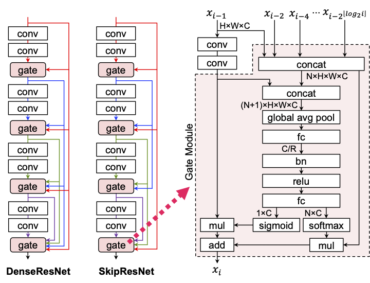

# What is SkipResNet ?

[](res/architecture.png)

SkipResNet is a Skip connected Residual convolutional neural Network for image recognition tasks.
Though an architecture of SkipResNets is a stack of Residual Blocks just like ResNets, each residual block has several inbounds from the previous blocks in same manner as DenseNets.
In order to improve the performance, a residual block in SkipResNets includes a Gate Module instead of element-wise additions in ResNets or concatenations in DenseNets.
A Gate Module contains an attention mechanism which selects useful features dynamically.
Experimental results indicate that an architecture of SkipResNets improves the performance in image classification tasks.

# What is DenseResNet ?

DenseResNet is a Densely connected Residual convolutional neural Network for image recognition tasks.
An architecture of DenseResNets is similar to SkipResNets, but the shortcut design is different.

<div class="clearfix"></div>

DenseResNets are published in a following paper:
1. Atsushi Takeda. "画像分類のためのDense Residual Networkの提案 (Dense Residual Networks for Image Classification)." The 23rd Meeting on Image Recognition and Understanding (MIRU2020), 2020 (in Japanese).

# How to use
## Dataset preparation
If you want to use the ImageNet dataset, you need to download the dataset archives and save them to `data/imagenet` (see [readme.txt](data/imagenet/readme.txt) for details). If you want to train a model with the CIFAR dataset, dataset preparation is not needed because the dataset will be downloaded automatically.

## Training
Run a training script which trains the model from scratch.
```
python src/train.py [config file] [output path]
```
For example, a following command trains a ResNet-110 model  using 2 GPUs with the CIFAR-100 dataset, and the results are saved in a output directory named `output_dir`.
```
python src/train.py \
    config/train/cifar100/ResNet-110.txt \
    output_directory \
    --gpus 0,1
```
This implementation supports training by using TPUs. A following command trains a ResNet-50 model using 8 TPUs with the ImageNet dataset loaded from Google Cloud Storage. In this case, you need to make shard files of the ImageNet dataset and stored them to Google Cloud Storage before starting the training.
```
python src/train.py \
    configs/imagenet/ResNet-50.txt \
    output_directory \
    --tpus 8 \
    --data gs://<your backet>/data/imagenet
```

<!--
# Performances
## Image Classification
### ImageNet-1k
|Model|# params|flops|top-1 acc.|settings|
|---:|:---:|:---:|:---:|:---|
|<br>ResNet-34<br>Skip-ResNet-34|3.50M<br>4.08M|315M<br>322M|72.66%<br>73.69%|[ResNet-34.txt](config/imagenet/ResNet-34.txt)<br>[Skip-ResNet-34.txt](config/imagenet/Skip-ResNet-34.txt)|
|ResNet-50<br>Skip-ResNet-50|5.48M<br>5.85M|236M<br>242M|74.14%<br>74.42%|[mobilenetv3-large.txt](config/imagenet/mobilenetv3-large.txt)|

### CIFAR-100
|Model|# params|flops|top-1 acc.|settings|
|---:|:---:|:---:|:---:|:---|
|ResNet-110<br>Dense-ResNet-110|1.74M<br>2.23M|258M<br>264M|79.03%<br>80.34%|[resnet-110.txt](config/cifar/resnet-110.txt)|

### CIFAR-10
|Model|# params|flops|top-1 acc.|settings|
|---:|:---:|:---:|:---:|:---|
|ResNet-110<br>Dense-ResNet-110|1.74M<br>2.23M|258M<br>264M|96.40%<br>96.59%|[resnet-110.txt](config/cifar/resnet-110.txt)|
-->
